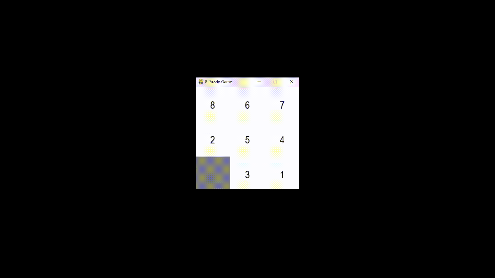

# 8x8-maze-BFS-puzzle-solver
Solves a 8x8 maze using Breadth First Search Algorithm

Provide the required start and goal maze configuration in bfs.py.

The algorithm will write down the series of parent child relationships in text files.

Run the animate.py file to run the maze solver pygame UI.

